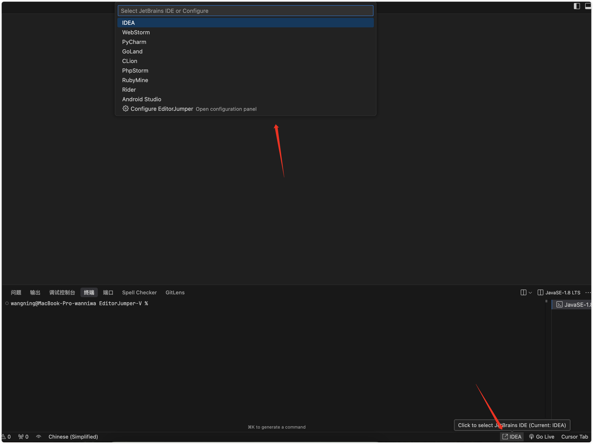

# EditorJumper

  

  
  
  

## 🔍 Introduction

EditorJumper is a VS Code extension that allows you to seamlessly jump between modern code editors (VS Code, Cursor, Trae, Windsurf) and JetBrains IDEs (such as IntelliJ IDEA, WebStorm, PyCharm, etc.). It maintains your cursor position and editing context, greatly improving development efficiency in multi-editor environments.

  

## 🌟 Features

- 🚀 **Seamless Editor Switching**
  - Quickly jump from VS Code, Cursor, Trae, or Windsurf to JetBrains IDEs
  - Automatically positions to the same cursor location (line and column)
  - Perfectly maintains editing context without interrupting workflow

- 🎯 **Smart Jump Behavior**
  - With file open: Opens the same project and file in the target IDE, preserving cursor position
  - Without file open: Opens the project directly in the target IDE

- ⚡ **Multiple Trigger Methods**
  - Right-click in editor - select "Open in JetBrains IDE"
  - Right-click in file explorer - select "Open in JetBrains IDE"
  - Customizable keyboard shortcuts

- 🎚️ **Easy Target IDE Selection**
  - Status bar widget - click the IDE icon to select which JetBrains IDE to jump to
  

  

## 💻 System Requirements

- VS Code 1.60.0 or higher, or other supported editors (Cursor, Trae, Windsurf)
- Installed JetBrains IDE (IntelliJ IDEA, WebStorm, PyCharm, etc.)

## 📥 Installation

1. Open VS Code (or other supported editor)
2. Go to Extensions view (Ctrl+Shift+X or Cmd+Shift+X)
3. Search for "EditorJumper"
4. Click the Install button

## ⚙️ Configuration

Click the settings icon (⚙️) in the status bar to open the configuration panel:

  

### Configuration Options
- Select default JetBrains IDE
- Add or edit custom IDE configurations
- Configure IDE paths
- Hide/show specific IDEs
- Customize keyboard shortcuts

## 🚀 Usage

1. **Via Right-Click Menu**
   - Right-click in the editor or file explorer
   - Select "Open in JetBrains IDE"

2. **Via Status Bar**
   - Click the IDE icon in the bottom status bar
   - Select your target JetBrains IDE
   - Use any trigger method to jump

3. **Via Keyboard Shortcuts**
   - Use customized shortcuts to quickly jump between editors

## 🔄 Complementary Use

For a complete bidirectional workflow, use this extension with [EditorJumper](https://github.com/wanniwa/EditorJumper) JetBrains plugin to enable jumping back from JetBrains IDEs to VS Code/Cursor/Trae/Windsurf.

## 🤝 Contribution

Pull Requests and Issues are welcome to help improve this plugin!

## 📄 License

This project is licensed under the MIT License - see the [LICENSE](LICENSE) file for details
